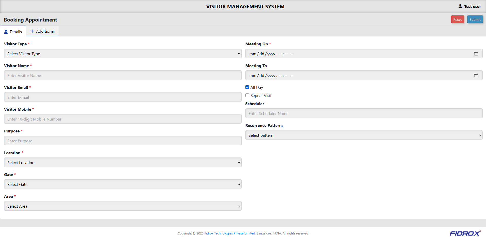
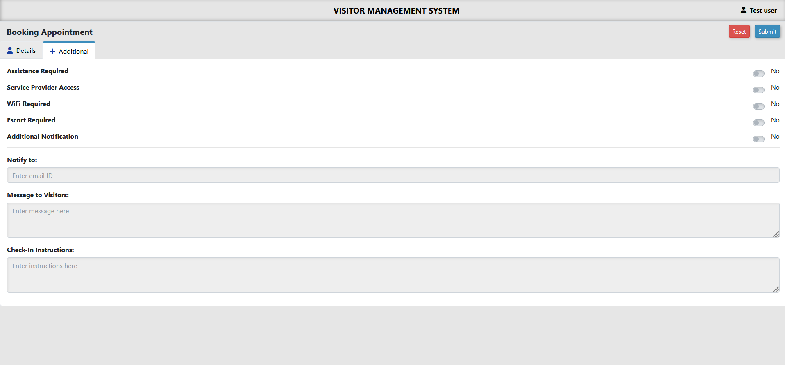

# 🗓️ Appointment UI Design

Hi there! 👋  
This is a clean and responsive web-based appointment form built using **HTML**, **CSS**, **JavaScript**, and the **AdminLTE** dashboard framework.

It was developed as part of my internship at **Fidrox Technologies**, where I was assigned a frontend task to implement a tabbed layout UI for booking appointments.

---

## 🌐 Live Developer Portfolio

Check out more about me and my work at:  
👉 [https://www.sudarsan.net.in/](https://www.sudarsan.net.in/)

---

## 🔧 Tech Stack

- HTML5 + CSS3  
- JavaScript (Vanilla)  
- Bootstrap 4  
- jQuery  
- Toastr (toast notifications)  
- jqGrid (data tables)  
- AdminLTE (admin UI template)

---

## 📸 Screenshots

| Details Tab | Additional Tab |
|-------------|----------------|
|  |  |

---

## 🧪 How to Run

1. Clone the repo
2. Open `index.html` in your browser
3. Done 🎉

---

## 📘 What I Learned

- Using AdminLTE for rapid UI development  
- Integrating various frontend tools together  
- Creating clean tabbed UIs  
- Writing readable and maintainable HTML/CSS

---

## 🙋‍♂️ About Me

**P. Sudarsan**  
B.Tech – Computer Engineering  
📧 [sudarsanjcr@gmail.com](mailto:sudarsanjcr@gmail.com)  
📱 +91 94411 54744  
🌐 [sudarsan.net.in](https://www.sudarsan.net.in/)

---

## 📄 License

This project is licensed under the MIT License.  
Feel free to use, share, and learn from it — just don't forget to drop a star ⭐ if you find it useful!
